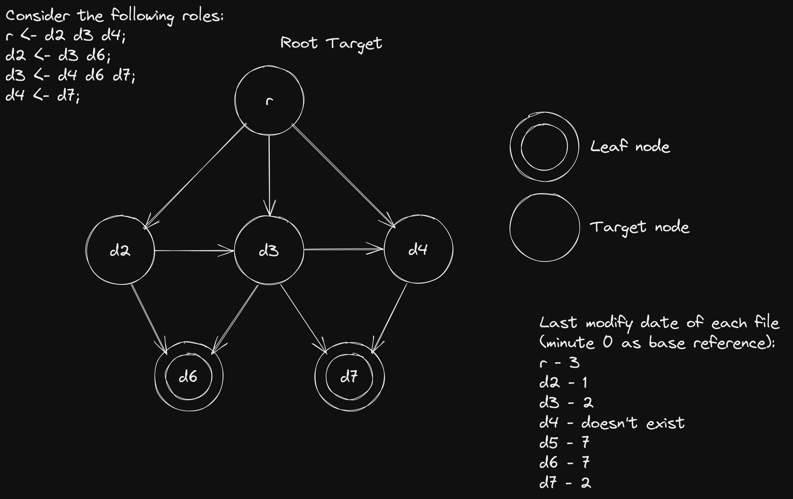
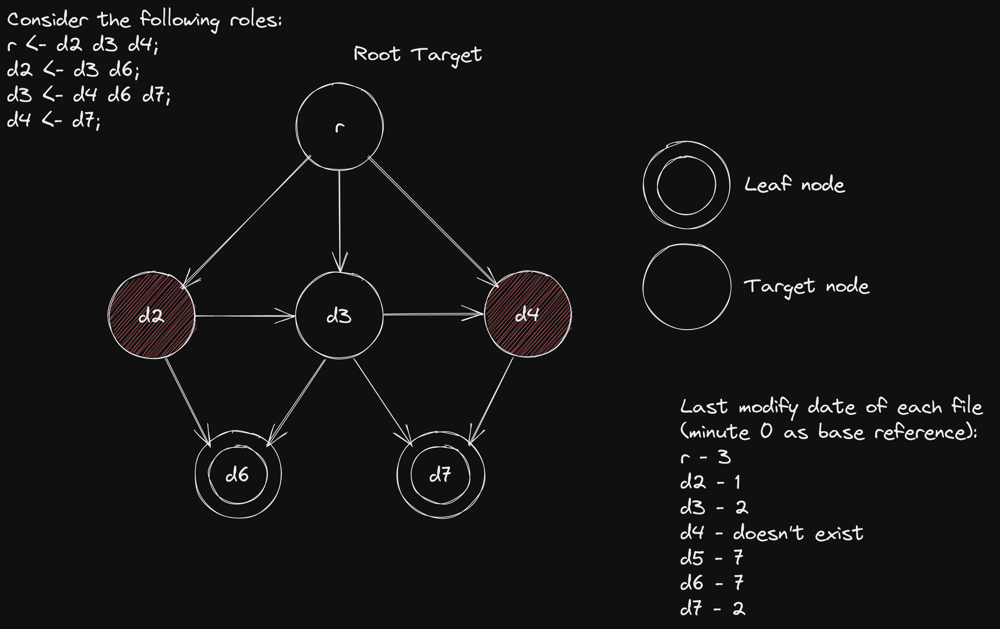

## Solution

### | Keynotes

- Leafs are the starting point of compilation. If they don't exist are built. After that, the compilation date or last modify date is send to all of its dependants.
- Each target receive the last modify date of its dependencies (it can be the last compilation date during execution or last modify date).
- If a given target doesn't exist, it simply waits for all dates sent by its dependencies and then proceeds to build.
- If a given target exist, then waits for the dates of its dependencies. If some of the dates is more recent than the target last modify date, then simply receives the remaining dates (i.e. waits for the other dependencies until they're ready), otherwise sends the last modify date to all of its dependants.
- After building a target, all dependants receive the build date.
- All nodes are goroutines workers.
- Each target node contains a channel (timesCh) for receiving the dates, one (panicCh) to receive a notification that has occurred an error in some other worker so they can terminate normally and another (errorCh) to send an error if the build went wrong. Besides that, those workers need to know their dependants so they can send the date.
- Leaf nodes need to have panicCh and errorCh channels and their dependants to propagate the date.
- The first build error is the one that's returned (all the others are ignored).

### | Cases

Aside:

- *t(n)* returns the compilation or last modify time of file n.
- These are only two of many examples since the execution is concurrent.

#### 1. Normal

- d6 and d7 doesn't need to build -> they already exist.
- d4 needs to be built -> doesn't exist (built at minute 8).
- d3 needs to be built -> ∀n ∈ { d4, d6 }. t(d3) < t(n) (one of those dates arrives first and triggers the build; built at minute 9).
- d2 needs to be built -> ∀n ∈ { d3, d6 }. t(d2) < t(n) (built at minute 10).
- r needs to be built -> ∀n ∈ { d2, d3, d4 }. t(r) < t(n) (built at minute ... we don't care).

#### 2. Error

- d6 and d7 do nothing.
- d2 and d4 send a build error.
- d2 error is received by the goroutine responsible for informing all nodes that an error has ocurred (r and d3 will receive this notification since they're still waiting for the dates).